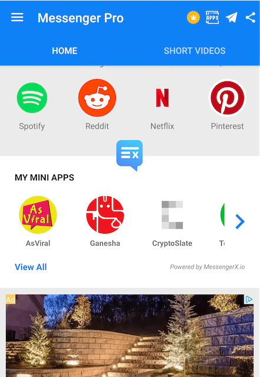

What is MessengerX.io?
=============================================================================
MessengerX.io is a platform for developers to build deeply personalized messaging experiences

   MessengerX.io - My Mini Apps (MessengerPro - Partner App Screenshot)

Our platform allows developers to build and expose their chatbots to millions of devices
on play store and beyond.

What are Messaging Apps?
=============================================================================
Messaging Apps or Chat Bots are light weight programs that can be ran inside an existing app
without any new installation required on the user side.

.. figure:: _static/images/ganesha_android_screenshot.png
   :scale: 25 %
   :align: center
   :alt: Ganesha - Your Horoscope Assistant

   Ganesha - Personalized Horoscope chatbot powered by GaneshaSpeaks.com

.. include:: ./ReadMe.rst

Bonus for Developers / Enterprise
=============================================================================
You can also make your existing messenger chat bot(s) run inside your own android / website / ios* in less than a day.

.. Indices and tables
.. ==================
..
.. * :ref:`genindex`
.. * :ref:`modindex`
.. * :ref:`search`
