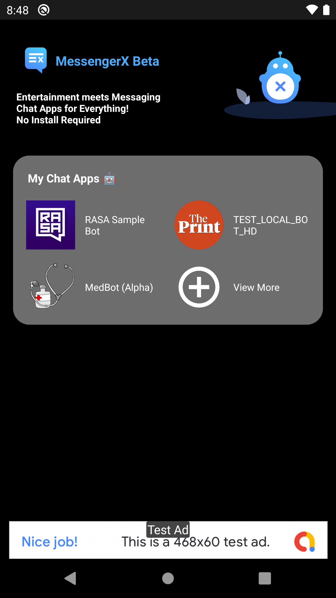
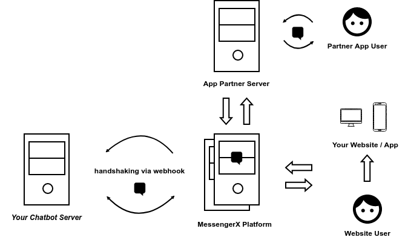

What is MessengerX.io? (Draft In Progress)
=============================================================================
MessengerX.io aim to aid developers looking to build and monetize deeply personalized messaging experiences.

   Multi Bot SDK - v0.751 - Beta - Your Personal Bot Store

The Problem
=============================================================================
The issue of customer acquisition has been plaguing the chatbot industry for sometime now.

Facebook's Messenger Platform, so far has been the only viable option available to truly get any kind of “traction” on your consumer facing bot.

Also, let's not forget the abilities of the Messenger Platform,
which are way ahead in our opinion than currently supported by Twitter, WhatsApp.

But that being said, the reach and the engagement has been severely impacted by the introduction of changes in Facebook Messenger Platform Policy
as well as the removal of the Discover Feature.

Even, if you were to look to WhatsApp as an alternative,
there is a marketing spend associated with promoting the phone number.

Such marketing spend numbers are generally not in the reach of independent developers or small businesses
who are looking to build deeply personalized chat bots.

Why MessengerX.io?
=============================================================================
With our unique learnings in the conversational space from processing over 2.5B+ messages from end consumers
in addition millions of active devices in our collective app ecosystem.

We see there is a gap between good chat bots and end users due to the nature of current messaging eco-systems.

We aim to bridge this gap between "great" chatbots and end users!

How it Works?
=============================================================================

   How it Works? - MessengerX.io

When a person sends a message to your bot through MessengerX SDKs integrated inside publisher or partner app(s).

The following set of events sequence should happen when a message is received destined for you bot.

* Our servers would route the incoming messages to Your Webhook or CHAT BOT URL, where your messaging app or chatbot is hosted.

* Using the Send Message API, the mini app or the chat bot can then respond to the person directly on the Partner App via our Platform APIs

As Darren Yau - Our lead chat bot developer puts it aptly,
“If you already have a Facebook Messenger based chatbot you can seamlessly launch
and expose your bot on millions of android devices within days if not hours!”

The MessengerX Platform is FREE for developers looking to build highly engaging consumer based chatbots.

What is a Chatbot?
=============================================================================
Messaging Apps or ChatBots are light weight programs that run inside an existing app
without any new installation required on the user side.

.. figure:: _static/images/ganesha_android_screenshot.png
   :scale: 25 %
   :align: center
   :alt: Ganesha - Your Horoscope Assistant

   Daily Horoscope Assistant (Powered by GaneshaSpeaks.com)

Receiving Messages from Users
=============================================================================
Understanding Webhooks
-----------------------------------------------------------------------------
Webhook is a REST endpoint url which denotes your custom functions / callbacks.

This is the end point which will receive any incoming messages destined for your bot.

Message Payload
-----------------------------------------------------------------------------
A message payload is a JSON representation of an incoming message sent by the end user.

Encrypted Incoming Message Payload
-----------------------------------------------------------------------------
The incoming messages that your webhook will receive are encrypted using HS512 algorithm with your token as the key.

Below is the JSON representation of the raw incoming message.

::

 {"raw":"eyJhbGciOiJIUziJ9.===jsY8eeeru2i1vcsJQ....."}

Decrypting Incoming Message Payload
-----------------------------------------------------------------------------
Decrypt the incoming payload with the secret_key provided.

You can use the open source JWT.io libraries available for all major programming languages

Let's quickly go through the sample representation of the decrypted incoming message object payload

* messaging: list of incoming message actions
* message_data: details about the nature of data sent.
* user: basic user details about the user requesting information.
* sender: the unique device id of the user.
* client: the partner app client id.
* version: android / web sdk client version
* silent: if silent is true, don't reply back to the request.

::

 {
   "sub":{
      "messaging":[
         {
            "message_data":{
               "text":"hi",
               "action_type":"get_started"
            },
            "user":{
               "userId":"JzBt502kWS",
               "creation_time":1589518339556,
               "device_id":"c311b145ed6a96d6",
               "email":"c311b145ed6a96d6@machaao.com",
               "timezone":"-7.0"
            },
            "sender":"dWnjre9rTr65ZeiOmrY1oU",
            "silent":false,
            "client":"messenger.---.debug",
            "version":"0.814"
         }
      ]
   }
 }

Sending Messages to Users
=============================================================================
Sending a outgoing message to users can be done by the usage of our core Send API

Sending Text
-----------------------------------------------------------------------------
Below is an example CURL request to send a message to a particular user id using our Core Messaging APIs.

::

    curl --location --request POST 'https://ganglia-dev.machaao.com/v1/messages/send' \
    --header 'api_token: f3aee970-9545-11ea-9119-8188df620b76' \
    --header 'Content-Type: application/json' \
    --header 'Content-Type: text/plain' \
    --data-raw '{
      "users":["<!--- USER ID -->"], // one ore more (max up to 10)
      "message":{
          "text": "I am a good bot",
          "quick_replies": [{
            "content_type": "text",
            "title": "Hi",
            "payload": "hi"
          }]
       }
    }'

Sending a Media Attachment
-----------------------------------------------------------------------------
Below is an example CURL request to send a message attachment to a particular user id using our Core Messaging APIs.

::

    curl --location --request POST 'https://ganglia-dev.machaao.com/v1/messages/send' \
    --header 'api_token: f3aee970-9545-11ea-9119-8188df620b76' \
    --header 'Content-Type: application/json' \
    --header 'Content-Type: text/plain' \
    --data-raw '{
      "users":["<!-- MACHAAO-USER-ID -->"],
      "message":{
          "attachment":{
             "type":"template",
             "payload":{
                "template_type":"generic",
                "elements":[
                   {
                      "title": "Test #786 - Duffle Bag + 200 Machaao Credits",
                      "subtitle":"Only Pay Shipping & Handling Charges. Combo Offer for Machaao Users only.",
                      "image_url":"https://provogue.s3.amazonaws.com/provogue-duffle1.jpg"
                   }
                ]
             }
          },
          "quick_replies": [{
            "content_type": "text",
            "title": "Hi",
            "payload": "hi"
          }]
       }
    }'

Sending a List of Media Attachment(s)
-----------------------------------------------------------------------------
Below is an example CURL request to send a message attachment to a particular user id using our Core Messaging APIs.

::

    curl --location --request POST 'https://ganglia-dev.machaao.com/v1/messages/send' \
    --header 'api_token: f3aee970-9545-11ea-9119-8188df620b76' \
    --header 'Content-Type: application/json' \
    --header 'Content-Type: text/plain' \
    --data-raw '{
      "users":["<!-- MACHAAO-USER-ID -->"],
      "message":{
          "attachment":{
             "type":"template",
             "payload":{
                "template_type":"generic",
                "elements":[
                   {
                      "title": "Test #786 - Duffle Bag + 200 Machaao Credits",
                      "subtitle":"Only Pay Shipping & Handling Charges. Combo Offer for Machaao Users only.",
                      "image_url":"https://provogue.s3.amazonaws.com/provogue-duffle1.jpg"
                   },
                   {
                      "title": "Test #787 - Duffle Bag + 200 Machaao Credits",
                      "subtitle":"Only Pay Shipping & Handling Charges. Combo Offer for Machaao Users only.",
                      "image_url":"https://provogue.s3.amazonaws.com/provogue-duffle1.jpg"
                   }
                ]
             }
          },
          "quick_replies": [{
            "content_type": "text",
            "title": "Hi",
            "payload": "hi"
          }]
       }
    }'

Small Businesses / Enterprise
=============================================================================
* Do you have an existing facebook messenger chatbot?
* Own your data with our SDKs
* Make your existing chatbot / platform work inside your client android app or website within hours.

Additional Perks for Developers
=============================================================================
In addition to the massive savings on marketing costs, the platform also offers
a developer suite looking to build deeply personalized apps:

* Rich Messaging Support via Core Messaging API
* Deep Personalization via Tagging API
* Deeper Engagement via Announcement API
* FREE Hosting for your chat bot (Subjected to Approval)
* Headless Conversational CMS API
* Data Capture API
* Transactional Wallet API
* Guaranteed Message Processing (Premium)
* Admin Dashboard (Premium)
* UI Bot Designer (Premium)

Partners
=============================================================================
Coming Soon

Active Contributors
=============================================================================
Coming Soon

Join our Gitter Community
=============================================================================

.. Indices and tables
.. ==================
..
.. * :ref:`genindex`
.. * :ref:`modindex`
.. * :ref:`search`
