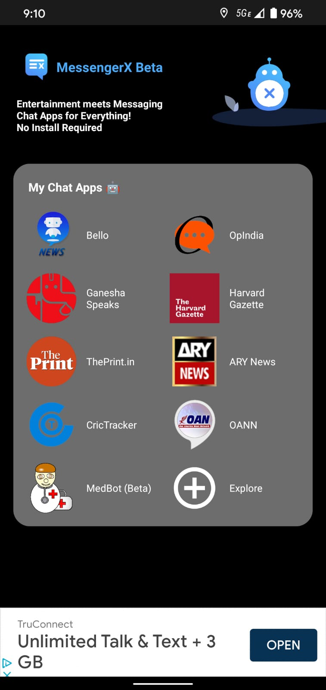
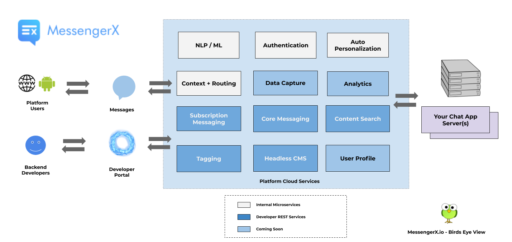
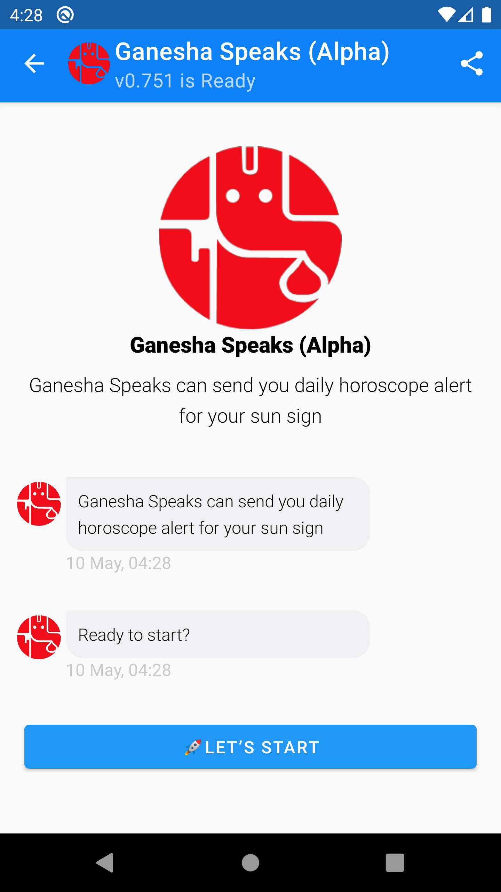
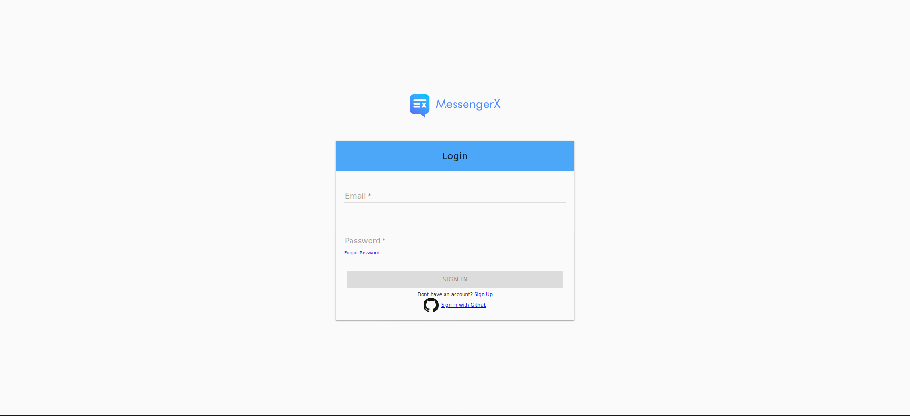
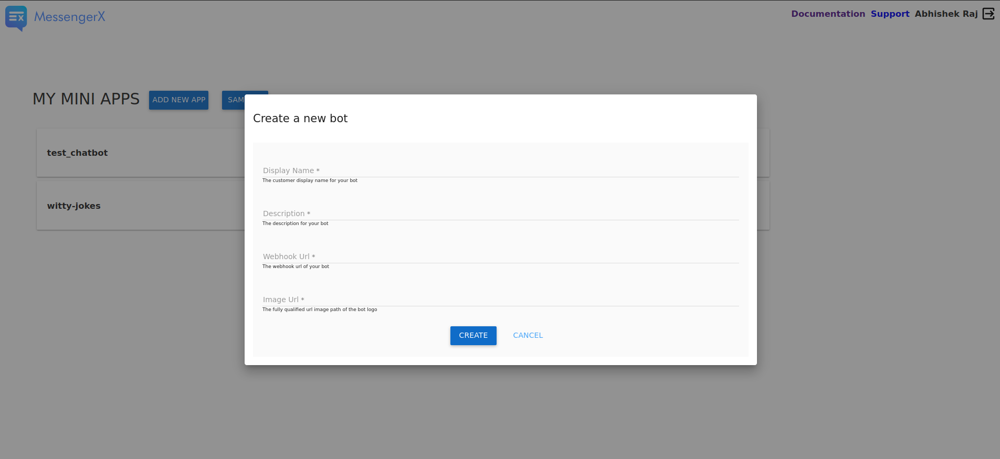

What is MessengerX.io?
=============================================================================
MessengerX.io is a consumer marketplace for everyday chat apps.

   MessengerX.io - Everyday Chat Apps for You

A joint venture between AppyHigh and MACHAAO with an aim to aid developers
looking to build and monetize deeply personalized chat experiences.

The Problem
=============================================================================
The issue of customer acquisition has been plaguing the chat apps industry for sometime now.

Facebook's Messenger Platform, so far has been the only viable option available
to truly get any kind of “organic” traction on your consumer facing bot.

But that being said, the reach and the engagement of your chat app would be severely impacted
by the introduction of some core changes in Facebook Messenger Platform Policy
as well as the removal of the "Discover" Feature.

Even, if you were to look to WhatsApp as an alternative, there is a marketing spend associated with promoting the "phone number".

Such marketing spend numbers are generally not in the reach of independent developers or even small businesses
who are looking to build deeply personalized chat apps.

Why MessengerX.io?
=============================================================================

With our unique learnings in the conversational space from processing over 2.5B+ messages
from or to end users.

We would like to claim that we do know a thing or two about making good chat apps :)

We also see an evidential gap between good messaging or chat apps and end users
due to the operating nature of current messaging eco-systems.

We aim to bridge this gap between "great" chat apps and end users!

How it Works?
=============================================================================

   How it Works? - MessengerX.io

When a user sends a message to your bot through Platform SDKs integrated inside publisher or partner app(s).

The following set of events sequence should take place when an incoming message is received destined for you bot.

* Our servers would route the incoming messages to Your Webhook or CHAT BOT URL, where your messaging app or chatbot is hosted.

* Using the Send Message API, the mini app or the chat bot can then respond to the person directly on the Partner App via our Platform APIs

The MessengerX Platform is FREE for developers looking to build highly engaging consumer based chat apps.

What are Chatbots?
=============================================================================
Chat Apps also called as Chat Bots are functional conversational programs
that one can chat with to carry on a series of complicated tasks in a quick fashion.

   Daily Horoscope Assistant (Powered by GaneshaSpeaks.com)

Get Started
=============================================================================

Signup via our Dev Portal
------------------------------------------
Signup and Get a FREE API Token
@ https://portal.messengerx.io

Click on Add New App
---------------------
.. figure:: _static/images/mxio_home.png
   :width: 1429px
   :height: 300px
   :align: center
   :alt: MessengerX.io - Home

Fill out the details
---------------------
You can place Webhook and Image Url as None till deployment of your Chat App to get started.

RASA + MessengerX.io Chat Bot Tutorial (YouTube Video)
---------------------
.. raw:: html

   <iframe width="560" height="315" src="https://www.youtube.com/embed/nIp7QRNci2U" frameborder="0" allow="accelerometer; autoplay; encrypted-media; gyroscope; picture-in-picture" allowfullscreen></iframe>

This is a beginner’s guide on how to build a python & RASA chatbot from scratch.

The video helps you build your first sample bot using RASA's open-source NLU template and lets you train your bot by writing logic in python.

Chatbot Showcase
-----------------------------------------------------------------------------
MedBot - Your Pocket Medical Guide

Built using Python + RASA using MessengerX API

Check out https://www.messengerx.io/medbot for a web demo

Configuring your Chat App Server
=============================================================================
Understanding Webhooks
-----------------------------------------------------------------------------
Webhook is a REST endpoint url which denotes your custom functions / callbacks.

This is the end point which will receive any incoming messages destined for your bot.

Understanding Message Payloads
-----------------------------------------------------------------------------
A message payload is a JSON representation of an incoming message sent by the end user.

Encrypted Incoming Message Payload
-----------------------------------------------------------------------------
The incoming messages that your webhook will receive are encrypted using HS512 algorithm with your token as the key.

Below is the JSON representation of the raw incoming message.

::

 {"raw":"eyJhbGciOiJIUziJ9.===jsY8eeeru2i1vcsJQ....."}

Decrypting Incoming Message Payload
-----------------------------------------------------------------------------
Decrypt the incoming payload with the secret_key provided.

You can use the open source JWT.io libraries available for all major programming languages

Let's quickly go through the sample representation of the decrypted incoming message object payload

* messaging: list of incoming message actions
* message_data: details about the nature of data sent.
* user: basic user info details about the user associated with the message.
* sender: the unique device id of the user.
* client: the partner app client id.
* version: android / web sdk client version
* silent: if silent is true, don't reply back to the request.

::

 {
   "sub":{
      "messaging":[
         {
            "message_data":{
               "text":"hi",
               "action_type":"get_started"
            },
            "user":{
               "userId":"<!-- USER_ID -->",
               "creation_time":1589518339556,
               "device_id":"311b145ed6a96d6",
               "email":"<c11b145ed6a96d6>@machaao.com",
               "timezone":"-7.0"
            },
            "sender":"dWnjre9rTr65ZeiOmrY1oU",
            "silent":false,
            "client":"messenger.---.debug",
            "version":"0.814"
         }
      ]
   }
 }

Sending On-Demand Responses
=============================================================================
Send a outgoing message in response to user's input can be done by the usage of our On Demand Messaging APIs as demonstrated below

Sending a Text Message with Quick Replies
-----------------------------------------------------------------------------
Below is an example CURL request to send a message / response to a particular user id using our Core Messaging APIs.

::

    curl --location --request POST 'https://ganglia-dev.machaao.com/v1/messages/send' \
    --header 'api_token: API_TOKEN' \
    --header 'Content-Type: application/json' \
    --header 'Content-Type: text/plain' \
    --data-raw '{
      "users":["<!--- UNIQUE_USER_ID -->"],
      "message":{
          "text": "I am a good bot",
          "quick_replies": [{
            "content_type": "text",
            "title": "Hi",
            "payload": "hi"
          }]
       }
    }'

Sending a Text Message with Buttons and Quick Response
-----------------------------------------------------------------------------
Below is an example CURL request to send a message / response to a particular user id using our Core Messaging APIs.

::

    curl --location --request POST 'https://ganglia-dev.machaao.com/v1/messages/send' \
    --header 'api_token: API_TOKEN' \
    --header 'Content-Type: application/json' \
    --header 'Content-Type: text/plain' \
    --data-raw '{
      "users":["<!--- UNIQUE_USER_ID -->"],
      "message":{
        "text": "I am a good bot",
        "buttons": [{
            "title": "Hi",
            "type": "postback",
            "payload": "hi"
        }, {
            "title": "Source",
            "type": "web_url",
            "url": "https://provogue.s3.amazonaws.com/provogue-duffle1.jpg"
         }],
          "quick_replies": [{
            "content_type": "text",
            "title": "Hi",
            "payload": "hi"
          }]
       }
    }'

Sending a Media Element with Quick Replies
-----------------------------------------------------------------------------
Below is an example CURL request to send a message attachment to a particular user id.

::

    curl --location --request POST 'https://ganglia-dev.machaao.com/v1/messages/send' \
    --header 'api_token: API_TOKEN' \
    --header 'Content-Type: application/json' \
    --header 'Content-Type: text/plain' \
    --data-raw '{
      "users":["<!-- UNIQUE_USER_ID -->"],
      "message":{
          "attachment":{
             "type":"template",
             "payload":{
                "template_type":"generic",
                "elements":[
                   {
                      "title": "Test #786 - Duffle Bag + 200 Machaao Credits",
                      "subtitle":"Only Pay Shipping & Handling Charges. Combo Offer for Machaao Users only.",
                      "image_url":"https://provogue.s3.amazonaws.com/provogue-duffle1.jpg"
                   }
                ]
             }
          },
          "quick_replies": [{
            "content_type": "text",
            "title": "Hi",
            "payload": "hi"
          }]
       }
    }'

Sending a Media Element with Buttons & Quick Replies
-----------------------------------------------------------------------------
Below is an example CURL request to send a message attachment to a particular user id with buttons.

::

    curl --location --request POST 'https://ganglia-dev.machaao.com/v1/messages/send' \
    --header 'api_token: API_TOKEN' \
    --header 'Content-Type: application/json' \
    --header 'Content-Type: text/plain' \
    --data-raw '{
      "users":["<!-- UNIQUE_USER_ID -->"],
      "message":{
          "attachment":{
             "type":"template",
             "payload":{
                "template_type":"generic",
                "elements":[
                   {
                      "title": "Test #786 - Duffle Bag + 200 Machaao Credits",
                      "subtitle":"Only Pay Shipping & Handling Charges. Combo Offer for Machaao Users only.",
                      "image_url":"https://provogue.s3.amazonaws.com/provogue-duffle1.jpg",
                      "buttons": [{
                        "title": "Hi",
                        "type": "postback",
                        "payload": "hi"
                       }, {
                        "title": "Source",
                        "type": "web_url",
                        "url": "https://provogue.s3.amazonaws.com/provogue-duffle1.jpg"
                       }]
                   }
                ]
             }
          },
          "quick_replies": [{
            "content_type": "text",
            "title": "Hi",
            "payload": "hi"
          }]
       }
    }'

Sending a List of Media Elements with Buttons & Quick Replies
-----------------------------------------------------------------------------
Below is an example CURL request to send a message attachment to a particular user id with buttons.

::

    curl --location --request POST 'https://ganglia-dev.machaao.com/v1/messages/send' \
    --header 'api_token: API_TOKEN' \
    --header 'Content-Type: application/json' \
    --header 'Content-Type: text/plain' \
    --data-raw '{
      "users":["<!-- UNIQUE_USER_ID -->"],
      "message":{
          "attachment":{
             "type":"template",
             "payload":{
                "template_type":"generic",
                "elements":[
                   {
                      "title": "Test #786 - Duffle Bag + 200 Machaao Credits",
                      "subtitle":"Only Pay Shipping & Handling Charges. Combo Offer for Machaao Users only.",
                      "image_url":"https://provogue.s3.amazonaws.com/provogue-duffle1.jpg",
                      "buttons": [{
                        "title": "Hi",
                        "type": "postback",
                        "payload": "hi"
                       }, {
                        "title": "Source",
                        "type": "web_url",
                        "url": "https://provogue.s3.amazonaws.com/provogue-duffle1.jpg"
                       }]
                   },
                   {
                      "title": "Test #787 - Duffle Bag + 200 Machaao Credits",
                      "subtitle":"Only Pay Shipping & Handling Charges. Combo Offer for Machaao Users only.",
                      "image_url":"https://provogue.s3.amazonaws.com/provogue-duffle1.jpg",
                      "buttons": [{
                        "title": "Hi",
                        "type": "postback",
                        "payload": "hi"
                       }, {
                        "title": "Source",
                        "type": "web_url",
                        "url": "https://provogue.s3.amazonaws.com/provogue-duffle1.jpg"
                       }]
                   }
                ]
             }
          },
          "quick_replies": [{
            "content_type": "text",
            "title": "Hi",
            "payload": "hi"
          }]
       }
    }'

Personalization, Tagging & User Engagement
=============================================================================
The personalization and engagement api is the core base to build sophisticated re-engaging bots.

The process starts with tagging a user, Tagging a user allows you to open up
multiple re-targeting or re-engagement use cases such as sending daily news, personalized responses, etc.

This opens up your chat bot to support variety of deeply personalized use cases without a need for a huge dev ops team.

Tag a User
-----------------------------------------------------------------------------
Annotate or Tag a user with values for deeper personalization.

::

    curl --location --request POST 'https://ganglia-dev.machaao.com/v1/users/tag/<USER_ID>' \
    --header 'api_token: <API_TOKEN>' \
    --header 'Content-Type: application/json' \
    --data-raw '{
      "tag": "preferred_languages",
      "status": 1,
      "values": ["en", "fr"],
      "displayName": "Languages"
    }'

Un-tag a User
-----------------------------------------------------------------------------
Un-tag a user for deeper personalization.

::

    curl --location --request POST 'https://ganglia-dev.machaao.com/v1/users/tag/<USER_ID>' \
    --header 'api_token: <API_TOKEN>' \
    --header 'Content-Type: application/json' \
    --data-raw '{
      "tag": "preferred_languages",
      "status": 0
    }'

Get all the Active Tags for a Particular User in Context
-----------------------------------------------------------------------------
Get all the tags for deeper personalization use cases.

::

    curl --location --request GET 'https://ganglia-dev.machaao.com/v1/users/tags/<USER_ID>' \
    --header 'api_token: <API_TOKEN>' \
    --header 'Content-Type: application/json'

Announcements (Subscription Messaging)
=============================================================================
Sending announcements in order to re-engage your bot user (rate limited to a max of 1 per hour per user)

Sample CURL Command
-----------------------------------------------------------------------------
Below is an example CURL request to send an announcement to a particular tag or list of tags using our Announcement APIs.

::

    curl --location --request POST 'https://ganglia-dev.machaao.com/v1/messages/announce' \
    --header 'api_token: API_TOKEN' \
    --header 'Content-Type: application/json' \
    --data-raw '{
      "tags":["india", "pakistan", "usa"],
      "message":{
          "text": "I am a good bot",
          "quick_replies": [{
            "content_type": "text",
            "title": "Hi",
            "payload": "hi"
          }]
       }
    }'

Headless CMS
=============================================================================
Tagging a user allows you to open up multiple re-targeting or re-engagement use cases such as sending daily news, personalized responses, etc.

Insert new content
-----------------------------------------------------------------------------
Auto-Annotate and insert content for your chat app.

::

    curl --location --request POST 'https://ganglia-dev.machaao.com/v1/content' \
    --header 'api_token: <API_TOKEN>' \
    --header 'Content-Type: application/json' \
    --data-raw '{
        "url": "https://www.youtube.com/watch?v=5UmM-tclggg",
        "tags": ["india", "pakistan", "bangladesh"]
    }'

Search API
-----------------------------------------------------------------------------
Allows you to perform search content for your chat app by query based in a paginated way.

::

   curl --location --request GET 'https://ganglia-dev.machaao.com/v1/content/search?q=ipl&limit=10&skip=0' \
   --header 'api_token: <API_TOKEN>' \
   --header 'Content-Type: application/json'

Open Source Samples
=============================================================================
Below are some samples which will help get you started
https://github.com/machaao/machaao-samples

RASA (Python Sample)
-----------------------------------------------------------------------------
https://github.com/machaao/rasa-sample-nlu-bot

Client Integration via SDKs
=============================================================================
Requirements
---------------------
JDK 8
Android Studio

Integrate your bot on your website
--------------------

**Step\_1**: Below is a sample script you need to paste into your
website to install webchat for your Machaao bot.

::

  

**Step\_2**: You will need to update variables above as shown below:

``themecolor`` : Put the desired color in hex or rgb format which will
be applied to the chat header background, buttons and message bubble
background.

``botname`` : The name of the bot that will appear on the chat header

``avatarurl`` : The url of the image that is shown on bot launcher icon.

``chathost`` : Url where the static assets for the webchat are hosted.

``machaaokey`` : The API token for your bot proivded by Machaao

Integrate your bot in your Android App
-------------------------

Add following to your app gradle file.

::

    maven {
        url "https://machaao-android-builds.s3.amazonaws.com/sdk/android/snapshots"
    }

    maven {
        url "https://machaao-android-builds.s3.amazonaws.com/sdk/android/releases"
    }

Add Gradle Dependency
---------------------

::

     debugImplementation('com.machaao.android:machaao-sdk:0.833-SNAPSHOT') {
            transitive = true
     }

     releaseImplementation('com.machaao.android:machaao-sdk:0.833') {
            transitive = true
     }

Modify Manifest (Add Token)
---------------------------

::

     <meta-data android:name="com.machaao.android.sdk.token"
    android:value="<!-- Replace with your bot / api token assigned by MACHAAO Inc (connect@machaao.com) -->" />

Add SingleBotActivity Reference to Manifest (Bot Developers)
------------------------------------------------------------

::

      <activity android:name="com.machaao.android.sdk.activities.SingleBotActivity"
            android:logo="@mipmap/ic_launcher"
            android:windowSoftInputMode="stateHidden|adjustResize"
            android:screenOrientation="portrait"
            android:launchMode="singleTop"
            tools:node="merge"
            android:theme="@style/AppTheme.Orange">
            <intent-filter>
                <action android:name="android.intent.action.MAIN" />
                <category android:name="android.intent.category.LAUNCHER" />
                <action android:name="android.intent.action.VIEW" />
            </intent-filter>
        </activity>

Intialize MACHAAO SDK
-----------------------------

::

     Machaao.initialize(this);

Launch Your Bot / Chat App via our SDK [For Bot Developers / Partners]
----------------------------------------------------------------------

::

      Intent intent = new Intent(this, SingleBotActivity.class);
      intent.putExtra("botToken", botToken);
      startActivity(intent);

Sample Android Chat App
@ https://github.com/machaao/machaao-samples/tree/master/basic_sample_bot/client/android/sample_bot_client

Bonus for Developers
=============================================================================
In addition to the massive savings on marketing and infrastructure costs, the platform also offers
multiple other Rest APIs dor developers looking to build deeply personalized super chat apps:

* Rich Messaging Support via On Demand Messaging API
* Deep Personalization via Tagging API
* Auto ML based Engagement via Announcement API
* Data Capture API (Subjected to Approval)
* Transactional Wallet API (Subjected to Approval)
* FREE Hosting for your chat bot (Subjected to Approval)
* Guaranteed Message Processing (Subjected to Approval)
* Admin Dashboard (Premium)

Small Businesses / Enterprise
=============================================================================
* Do you have an existing facebook messenger chatbot?
* Make your existing chatbot / platform work inside your client android app or website within hours (iOS coming soon).
* Conversational Bot Designer (Premium)

Other Resources
=============================================================================
Partner Deck: https://docsend.com/view/jxdbrcf

Join our Gitter Community
=============================================================================
Coming Soon

.. Indices and tables
.. ==================
..
.. * :ref:`genindex`
.. * :ref:`modindex`
.. * :ref:`search`
